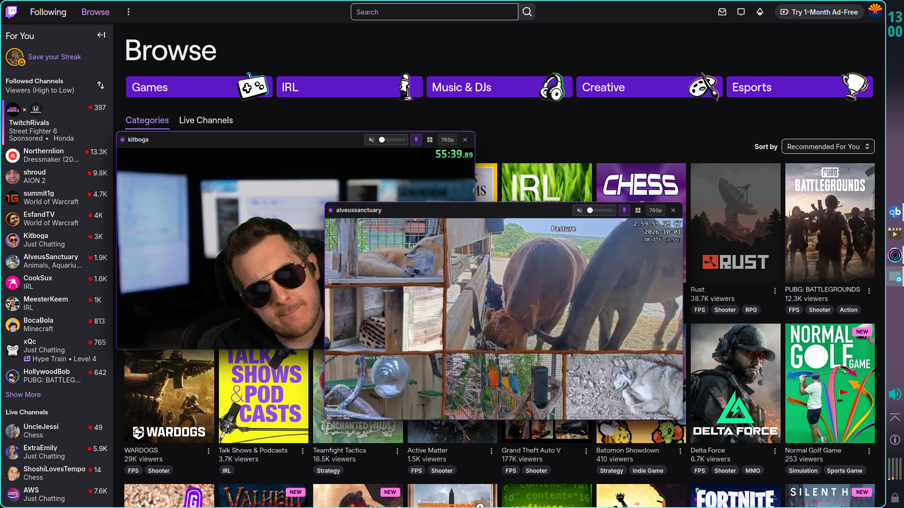
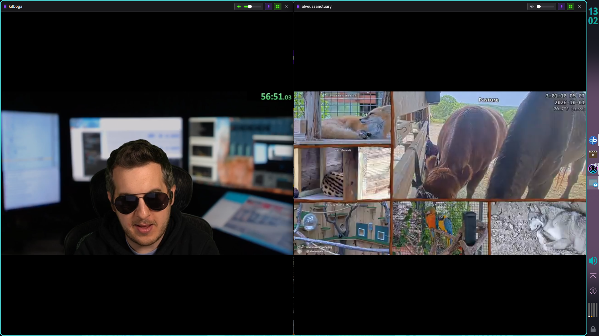
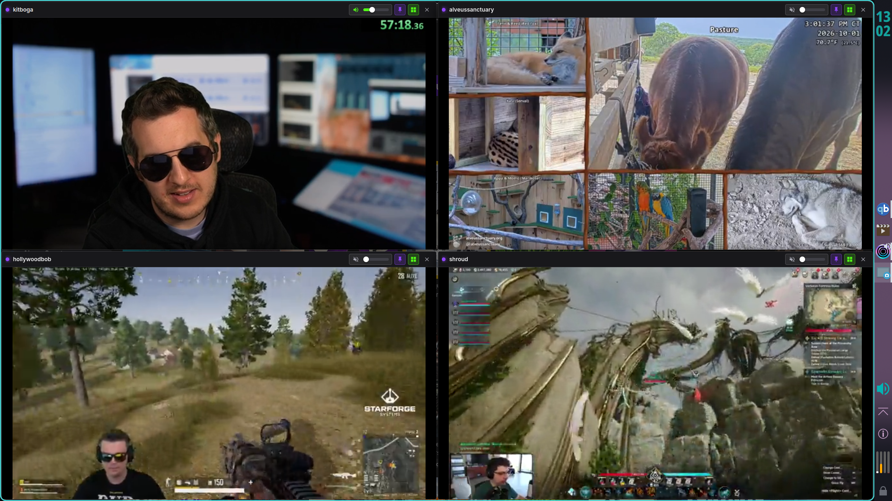
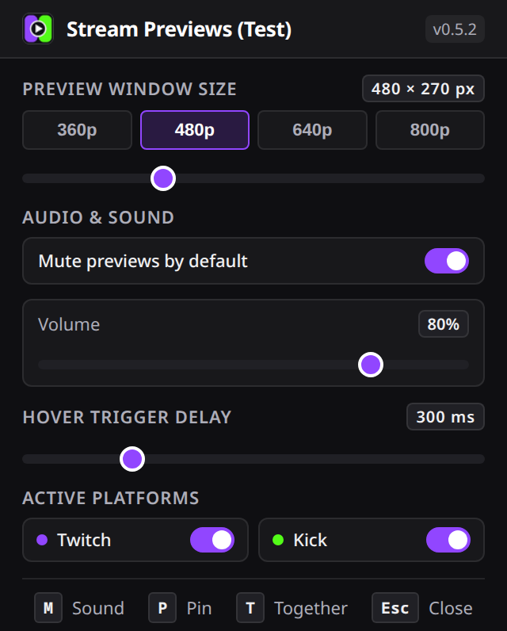

# Stream Previews (Twitch & Kick)

**Fast, lightweight live video hover previews, individual volume sliders, multi-stream pinned overlays, and Play Together grid tiling for Firefox.**

[](https://addons.mozilla.org/en-US/firefox/addon/stream-previews-twitch-kick/)
[](https://github.com/PlasmaDrifter/twitch-kick-previews/releases/latest)
[](LICENSE)
[](https://twitch.tv)
[](https://kick.com)

---

## Overview

**Stream Previews** is a modern, bloat-free Firefox WebExtension built specifically for Twitch and Kick. It enables instant live video hover previews across directory pages and followed sidebar channels without interrupting your current page or opening extra browser tabs.

Unlike legacy or commercial preview extensions, Stream Previews contains zero analytics, zero external tracking, zero advertising scripts, and zero subscriptions.

---

## Screenshots

### Live Stream Hover Preview
Hover over any followed channel or browse card to instantly watch a live stream preview while another broadcast continues playing:


---

### Multi-Stream Floating Overlays
Pin multiple broadcasts simultaneously and reposition them across your screen while continuing to browse other channels and categories:



---

### Play Together: 50/50 Split Screen
Press `T` or click the grid icon when two streams are pinned to tile them across your entire viewport:



---

### Play Together: 2x2 Multi-View Grid
Tile up to four pinned streams simultaneously into a clean full-screen grid layout:



---

### Compact Settings Panel
Access preset resolutions, volume defaults, hover trigger delays, and platform toggles without any vertical scrolling:



---

## Key Features

- **Live Video Hover Previews**: Hover over any live stream card or sidebar channel on `twitch.tv` and `kick.com` to watch the stream in a floating video preview overlay.
- **Per-Stream Volume Control**: Every preview window includes its own horizontal volume slider and sound toggle directly on the top header bar with borderless controls. Adjust volume from 0% to 100% per stream on the fly.
- **Continuous Playback Protection**: Guarded against host player DOM mutations and automated re-muting, ensuring clean uninterrupted sound playback.
- **Pin Multiple Floating Overlays**: Click the pin icon or press `P` to detach any preview window into a floating overlay. Pin as many simultaneous streams as your hardware allows.
- **Play Together (Full-Screen Viewport Tiling)**:
  - 1 Pinned Stream + Active Stream Page: 50/50 horizontal split tiling the main stream and pinned stream side-by-side with automatic host audio management.
  - 2 Streams: 50/50 horizontal split.
  - 3 Streams: Theater multi-view layout (main stage left, stacked secondary right).
  - 4 Streams: 2x2 four-way multi-view grid.
  - Press `T` again or `Esc` to restore floating positions and sizes instantly.
- **Drag-and-Drop Tile Swapping**: Click and drag from any stream header in Dual+ mode to swap positions with another stream tile. Real-time visual drop targeting smoothly rearranges tiles without reloading iframes or interrupting playback.
- **4-Way Move & Quadrant Popover**: In 4-stream Dual+ mode, use the electric-cyan 4-way move button (`✥`) or press `S` to open an instant quadrant picker (`TL`, `TR`, `BL`, `BR`).
- **Direct Quadrant Hotkeys (`1`, `2`, `3`, `4`)**: Hover any stream in 4-stream Dual+ mode and press `1`, `2`, `3`, or `4` on your keyboard to immediately assign it into that corner.
- **Seamless Zero-Gap Mode**: When colored borders are turned off in settings, outer margins and inter-stream gaps are completely eliminated (`gap = 0`), creating a flush edge-to-edge video wall.
- **Configurable Colored Borders**: Choose between multi-color distinct borders per slot, single colors, or a custom color picker in the popup settings.
- **Quick-Cycle Dimensions**: Switch between 360p, 480p, 640p, and 800p presets with a single header button click, or fine-tune width via the toolbar popup slider.
- **Pointer-Capture Dragging**: Smooth, tear-free window dragging that will not get swallowed or trapped by cross-origin video iframes.
- **Anti-Flicker Hover Delay**: Configurable debounce delay (default 300ms) prevents unwanted popups while scrolling rapidly through channels.
- **Dark Theme Interface**: Native dark UI matching Twitch and Kick aesthetics, featuring colored status dots and clean controls.

---

## Keyboard Shortcuts

| Shortcut | Action | Scope |
| --- | --- | --- |
| `M` | Toggle audio (unmute / mute) | Active hovered preview or pinned window |
| `P` | Pin / Detach stream overlay | Active preview window |
| `T` | Toggle Play Together / Dual+ grid tiling | Active when 2 to 4 streams are pinned, or 1 stream pinned on an active stream page |
| `S` | Swap positions / Promote to main stage / Open quadrant picker | Active stream tile in Dual+ mode |
| `1` - `4` | Move stream directly to quadrant (TL, TR, BL, BR) | Hovered stream tile in 4-stream Dual+ mode |
| `Esc` | Close active preview overlay / Exit tile mode / Close popover | Active preview window or viewport |
| **Drag Header** | Reposition floating window or drag-to-swap in Dual+ | Any pinned preview window |

---

## Project Structure

```text
twitch-kick-previews/
├── images/                  # Screenshots, store banners, and master icons
├── release/                 # Production extension source
│   ├── background.js        # Background service script
│   ├── build.sh             # Packaging script
│   ├── content/             # Core overlay controller and site detectors
│   │   ├── kick.js          # Kick event delegation and channel extraction
│   │   ├── player-frame.js  # Iframe video and audio controller
│   │   ├── preview.css      # Overlay, header, slider, and tile styling
│   │   ├── preview-core.js  # Multi-window DOM and state manager
│   │   └── twitch.js        # Twitch event delegation and card selectors
│   ├── icons/               # 16px to 128px icon assets
│   ├── manifest.json        # Firefox MV3 manifest
│   └── popup/               # Toolbar settings popup (HTML, CSS, JS)
├── .gitignore
└── README.md
```

---

## Installation

### Official Firefox Add-on (Recommended)

Install Stream Previews directly from the official Mozilla Add-ons directory:

**[Get Stream Previews on addons.mozilla.org](https://addons.mozilla.org/en-US/firefox/addon/stream-previews-twitch-kick/)**

Once installed, future updates are delivered and installed automatically by Firefox.

### Direct XPI Installation (GitHub Releases)

1. Download `twitch-kick-previews.xpi` from the [Latest Release](https://github.com/PlasmaDrifter/twitch-kick-previews/releases/latest).
2. Open Firefox and go to `about:addons` (or press `Ctrl+Shift+A` / `Cmd+Shift+A`).
3. Click the gear icon in the top-right corner and select **"Install Add-on From File..."**.
4. Select the downloaded `twitch-kick-previews.xpi` file.

### Manual / Developer Installation
1. Clone this repository:
   ```bash
   git clone https://github.com/PlasmaDrifter/twitch-kick-previews.git
   cd twitch-kick-previews
   ```
2. Open Firefox and enter `about:debugging#/runtime/this-firefox` in the address bar.
3. Click **"Load Temporary Add-on..."**.
4. Select `release/manifest.json`.
5. Navigate to `twitch.tv` or `kick.com` to begin previewing streams.

---

## Building the Package

To build the clean `.zip` and `.xpi` archive for AMO submission or local distribution:

```bash
cd release
./build.sh
```

The script extracts the version number dynamically from `manifest.json`, cleans old build archives, and outputs:
- `stream-previews-v<VERSION>.zip` (clean archive for AMO upload)
- `twitch-kick-previews.xpi` (local Firefox add-on file)

---

## Privacy & Security

- **No Remote Scripts**: All JavaScript executes locally from within the extension package.
- **No Analytics / Telemetry**: No third-party network requests, beacons, or tracking pixels.
- **Minimal Permissions**: Uses only `storage` for saving user preferences locally and host permissions restricted strictly to Twitch and Kick player domains.
- **AMO Compliant**: Fully declared `data_collection_permissions: { required: ["none"] }` in Gecko settings.

---

## License

MIT License. See [LICENSE](LICENSE) for details.
